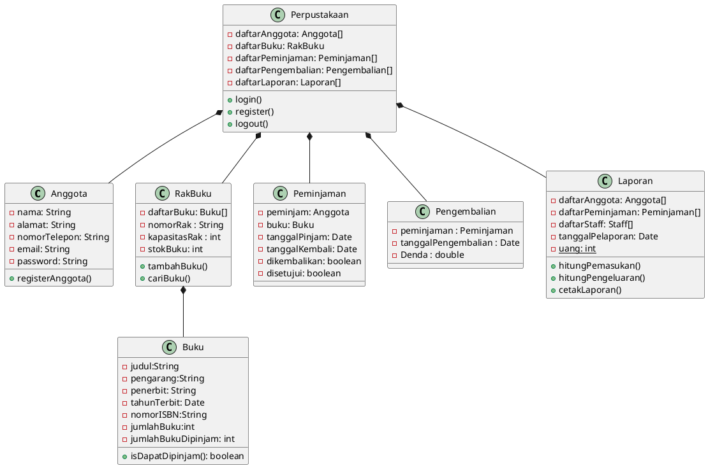
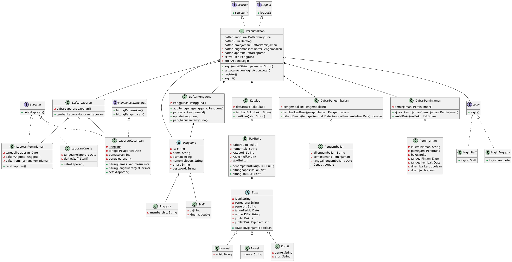

# PBO2023-2KS4-Aplikasi Perpustakaan

```
      [ KELOMPOK 3 PBO KELAS 2KS4 ]
            ANGGOTA KELOMPOK :

- Aditya Widiyanto Nugroho  (222111845)
- Azmi Zulfani Putri        (222111940)
- Fathimah Az-Zahra         (222112047)
- Himawan Wahid Ikhwansyah  (222112094)
- R.Faras Roihan Armel      (222112296)
- Zidan Al Azizi            (222112433)
- Nabila Widya Putri        (222112236)
- Ni Putu Sancita M. A.     (222112258)
```
## Daftar Isi
1. [Studi Kasus](#studi-kasus-aplikasi-perpustakaan)
2. [Identifikasi Awal](#identifikasi-awal)
3. [Implementasi Prinsip Desain Berorientasi Objek](#implementasi-prinsip-desain-berorientasi-objek)<br>
    3.1 [Single Responsibility Principle (SRP)](#1-single-responsibility-principle-srp)<br>
    3.2 [Open-Closed Principle (OCP)](#2-open-closed-principle-ocp)<br>
    3.3 [Liskov Substitution Principle (LSP)](#3-liskov-substitution-principle-lsp)<br>
    3.4 [Interface Segregation Principle (ISP)](#4-interface-segregation-principle-isp)<br>
    3.5 [Dependency Inversion Principle (DIP)](#5-dependency-inversion-principle-dip)

## Studi Kasus Aplikasi Perpustakaan

Aplikasi perpustakaan adalah suatu sistem yang digunakan untuk mengelola dan memfasilitasi aktivitas pengelolaan perpustakaan secara digital. Proses bisnis aplikasi perpustakaan melibatkan beberapa tahapan, di antaranya:

1. Pendaftaran Anggota: Proses ini melibatkan pendaftaran anggota baru dengan mengisi formulir pendaftaran online, termasuk informasi seperti nama, alamat, nomor telepon, dan alamat email.

2. Manajemen Koleksi Buku: Proses ini meliputi manajemen koleksi buku, mulai dari penerimaan, katalogisasi, penempatan, pencarian dan peminjaman buku oleh anggota. Hal ini memerlukan sistem pencatatan yang akurat untuk memudahkan pencarian buku, serta memastikan bahwa buku yang dipinjam kembali ke tempatnya dengan tepat waktu.

3. Peminjaman Buku: Proses ini melibatkan anggota perpustakaan yang ingin meminjam buku. Anggota dapat melakukan pencarian buku yang diinginkan melalui aplikasi perpustakaan, kemudian melakukan pemesanan secara online. Setelah pengajuan peminjaman disetujui, anggota dapat mengambil buku di perpustakaan.

4. Pengembalian Buku: Proses ini melibatkan pengembalian buku yang dipinjam oleh anggota. Anggota harus mengembalikan buku sebelum tanggal jatuh tempo. Jika terlambat, anggota akan dikenakan denda keterlambatan.

5. Pengelolaan Keuangan: Proses ini melibatkan pengelolaan keuangan perpustakaan, seperti penerimaan biaya pendaftaran anggota, penerimaan biaya denda, dan pembayaran tagihan pemasok buku.

6. Pelaporan dan Analisis: Proses ini melibatkan pelaporan dan analisis kegiatan perpustakaan, seperti laporan peminjaman, pemasukan dan pengeluaran, serta analisis kinerja perpustakaan.

Dalam bisnis aplikasi perpustakaan, penting untuk memastikan bahwa sistem yang digunakan dapat memudahkan pengelolaan perpustakaan, meningkatkan efisiensi, dan memberikan pengalaman pengguna yang baik bagi anggota perpustakaan. Hal ini dapat membantu meningkatkan kepuasan anggota dan meningkatkan penggunaan perpustakaan secara keseluruhan.

## Identifikasi Awal

### Identifikasi Kelas
1.  Anggota
2.  Buku
3.  Rak Buku
4.  Peminjaman
5.  Pengembalian
6.  Laporan
7.  Perpustakaan

### Identifikasi Method
1.  Pendfataran Anggota
2.  Manajemen Koleksi Buku
3.  Peminjaman Buku
4.  Pengembalian Buku
5.  Pengelolaan Keuangan

### UML Diagram Awal


## Implementasi Prinsip Desain Berorientasi Objek

### UML Diagram Hasil



### 1. Single Responsibility Principle (SRP)

Single Responsibility Principle (SRP) adalah prinsip desain yang menyatakan bahwa sebuah kelas atau modul harus memiliki satu dan hanya satu tanggung jawab. Dalam diagram di atas, terdapat beberapa contoh implementasi SRP, yaitu:

1.  Kelas Pengguna: bertanggung jawab untuk menyimpan informasi pengguna, seperti id, nama, alamat, nomor telepon, email, dan password. Kelas ini hanya memiliki satu tanggung jawab yaitu mengatur data pengguna.

2.  Kelas Anggota dan Kelas Staff: keduanya merupakan subclass dari kelas Pengguna dan bertanggung jawab untuk menyimpan informasi tambahan terkait anggota dan staff perpustakaan. Dalam hal ini, kelas Anggota menyimpan informasi keanggotaan, sedangkan kelas Staff menyimpan informasi gaji dan kinerja.

3.  Kelas Buku dan subclassnya, yaitu Kelas Journal, Kelas Novel, dan Kelas Komik: bertanggung jawab untuk menyimpan informasi terkait buku, seperti judul, pengarang, penerbit, tahun terbit, nomor ISBN, jumlah buku, dan jumlah buku yang dipinjam. Masing-masing subclass hanya memiliki satu tanggung jawab yaitu menyimpan informasi spesifik dari jenis buku tertentu.

4.  Kelas RakBuku: bertanggung jawab untuk menyimpan informasi terkait rak buku, seperti daftar buku yang tersedia di rak tersebut, nomor rak, kategori, kapasitas rak, dan stok buku. Kelas ini hanya memiliki satu tanggung jawab yaitu mengatur data terkait rak buku.

5.  Kelas DaftarPengguna, Kelas DaftarPeminjaman, Kelas DaftarPengembalian, dan Kelas DaftarLaporan: bertanggung jawab untuk menyimpan dan mengatur data terkait pengguna, peminjaman, pengembalian, dan laporan perpustakaan. Masing-masing kelas hanya memiliki satu tanggung jawab yaitu mengelola data terkait jenis data yang disimpannya.

6.  Kelas Peminjaman dan Kelas Pengembalian: bertanggung jawab untuk menyimpan informasi terkait peminjaman dan pengembalian buku, seperti id, pengguna yang meminjam, buku yang dipinjam, tanggal pinjam dan kembali, dan status pengembalian. Masing-masing kelas hanya memiliki satu tanggung jawab yaitu menyimpan informasi terkait proses peminjaman dan pengembalian buku.

7. Kelas LaporanKeuangan, Kelas LaporanPeminjaman, dan Kelas LaporanKinerja: bertanggung jawab untuk menghasilkan laporan terkait keuangan, peminjaman, dan kinerja perpustakaan. Masing-masing kelas hanya memiliki satu tanggung jawab yaitu menghasilkan laporan sesuai dengan jenis laporan yang dimiliki.

8.  Kelas Perpustakaan: merupakan kelas yang mengintegrasikan semua kelas dalam diagram UML yang dihasilkan dan bertanggung jawab untuk mengatur interaksi antar kelas dan menjalankan proses bisnis perpustakaan, seperti login, register, dan logout.

### 2. Open-Closed Principle (OCP)

Open-Closed Principle (OCP) adalah prinsip desain software yang menyatakan bahwa sebuah entitas atau modul perangkat lunak harus terbuka untuk ekstensi (open for extension) namun tertutup untuk modifikasi (closed for modification). Contoh penerapan OCP dapat diimplementasikan pada beberapa kelas, yaitu:

1. Kelas DaftarPengguna: Kelas ini terbuka untuk ekstensi ketika kita ingin menambahkan jenis pengguna baru, seperti Pegawai atau Dosen, namun tertutup untuk modifikasi karena setiap pengguna masih memiliki atribut yang sama dengan kelas induk Pengguna, yakni atribut id untuk setiap pengguna.

2. Kelas Buku: Kelas ini terbuka untuk ekstensi ketika kita ingin menambahkan jenis buku baru, seperti Buku Sejarah atau Buku Majalah, namun tertutup untuk modifikasi karena setiap jenis buku masih memiliki atribut yang sama dengan kelas induk Buku.

3. Kelas Perpustakaan: Kelas ini terbuka untuk ekstensi ketika kita ingin menambahkan fitur baru, seperti menghitung jumlah buku yang hilang, namun tertutup untuk modifikasi karena fitur-fitur inti yang sudah ada, seperti peminjaman buku, masih berjalan sesuai dengan implementasi awal.

4. Interface ManajemenKeuangan dan Laporan: merupakan contoh implementasi OCP pada level interface. Kedua interface ini menyediakan operasi atau metode untuk melakukan hitung pemasukan, hitung pengeluaran, dan cetak laporan. Interface-interface ini dapat diimplementasikan oleh kelas-kelas lain yang membutuhkan fitur tersebut, sehingga mengikuti prinsip open for extension. Namun, interface-interface ini tidak perlu dimodifikasi ketika ada perubahan pada kelas-kelas pengimplementasinya, sehingga juga memenuhi prinsip closed for modification.

Dalam semua kasus di atas, implementasi OCP memungkinkan kita untuk menambahkan fitur baru dan jenis baru tanpa harus memodifikasi kode yang sudah ada, sehingga dapat mempercepat pengembangan perangkat lunak dan mengurangi risiko bug akibat perubahan kode yang tidak terkendali.

### 3. Liskov Substitution Principle (LSP)

Liskov Substitution Principle (LSP) adalah prinsip desain pada pemrograman berorientasi objek yang menyatakan bahwa sub-kelas harus dapat digunakan sebagai pengganti kelas induknya tanpa mempengaruhi kebenaran dari program yang menggunakan kelas tersebut. Dengan kata lain, kelas turunan harus sesuai dengan kontrak yang diberikan oleh kelas induknya.

Pada diagram diatas, implementasi LSP dapat dilihat pada beberapa kelas, yaitu:

1.  Kelas Anggota dan Staff merupakan sub-kelas dari kelas Pengguna. Kedua kelas ini dapat digunakan sebagai pengganti dari kelas Pengguna dalam konteks aplikasi perpustakaan. Hal ini dapat dilihat dari atribut-atribut yang dimiliki oleh kelas Anggota dan Staff, yang juga dimiliki oleh kelas Pengguna.

2.  Kelas Journal, Novel, dan Komik merupakan sub-kelas dari kelas Buku. Ketiga kelas ini dapat digunakan sebagai pengganti dari kelas Buku dalam konteks aplikasi perpustakaan. Hal ini dapat dilihat dari method isDapatDipinjam() yang dimiliki oleh kelas Buku, yang juga dimiliki oleh kelas Journal, Novel, dan Komik.

### 4. Interface Segregation Principle (ISP)

Interface Segregation Principle (ISP) adalah prinsip desain yang mengusulkan bahwa "Klien tidak harus dipaksa untuk mengimplementasikan metode yang mereka tidak butuhkan." Dalam diagram di atas, ISP dapat diimplementasikan dengan memisahkan interface menjadi beberapa bagian yang spesifik. Hal ini dapat dilakukan dengan cara memecah interface yang terlalu umum dan kompleks menjadi beberapa interface yang lebih spesifik dan terfokus pada satu tugas atau fungsi tertentu. Berikut adalah beberapa contoh implementasi ISP pada diagram di atas:

1.  ManajemenKeuangan dan Laporan merupakan penerapan dari Interface Segregation Principle (ISP), yaitu ManajemenKeuangan dan Laporan. Interface ManajemenKeuangan berisi metode-metode yang berkaitan dengan pengelolaan keuangan perpustakaan, sedangkan interface Laporan berisi metode-metode yang berkaitan dengan pencetakan laporan-laporan yang berhubungan dengan kegiatan perpustakaan.

2.  Login, Register, dan Logout juga dapat dipisahkan menjadi tiga interface yang berbeda, yaitu Login, Register, dan Logout. Hal ini berguna untuk memisahkan fungsi-fungsi yang terkait dengan otentikasi dan identifikasi pengguna menjadi tiga interface yang berbeda, sehingga klien dapat mengimplementasikan hanya metode-metode yang diperlukan.

3.  Sebenarnya masih banyak interface yang dapat diekstraksi dari class tetapi kami tidak memasukkanya untuk memperkecil ukuran uml.

Dengan memisahkan interface menjadi beberapa bagian yang spesifik, ISP dapat membantu untuk mengurangi kompleksitas dan meningkatkan fleksibilitas pada desain sistem.

### 5. Dependency Inversion Principle (DIP)

Dependency Inversion Principle (DIP) adalah prinsip desain berorientasi objek yang menyatakan bahwa modul yang lebih tinggi tidak harus bergantung pada modul yang lebih rendah, tetapi keduanya harus bergantung pada abstraksi. Prinsip ini juga menyatakan bahwa abstraksi tidak boleh bergantung pada detail, tetapi detail harus bergantung pada abstraksi.

1.  Kelas Perpustakaan merupakan kelas yang lebih spesifik, dan memiliki ketergantungan terhadap DaftarPengguna, Katalog, DaftarPeminjaman, DaftarPengembalian, dan DaftarLaporan. Namun, kelas-kelas tersebut terlebih dahulu dibuat dengan level abstraksi yang lebih tinggi, seperti Pengguna, Buku, Peminjaman, Pengembalian, dan Laporan. Hal ini membuat Perpustakaan bergantung pada modul-modul yang lebih abstrak, dan bukan sebaliknya.

2.  Selain itu, pada diagram tersebut juga terdapat penggunaan interface sebagai blueprint yang harus diikuti oleh kelas-kelas tertentu, seperti ManajemenKeuangan, Laporan, Login, Register, dan Logout. Dengan menggunakan interface, maka kelas-kelas yang mengimplementasikan interface tersebut harus mematuhi blueprint yang ada pada interface tersebut.

Implementasi DIP ini membantu menjaga hubungan antar kelas menjadi lebih longgar dan fleksibel, sehingga jika terdapat perubahan pada salah satu modul, maka tidak akan mempengaruhi modul-modul lainnya. Hal ini dapat memudahkan dalam pengembangan dan perawatan sistem perpustakaan yang kompleks.
